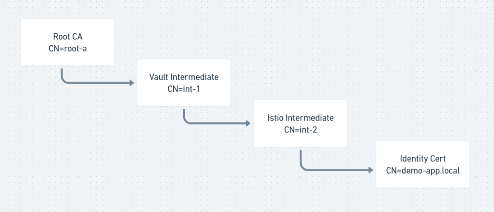
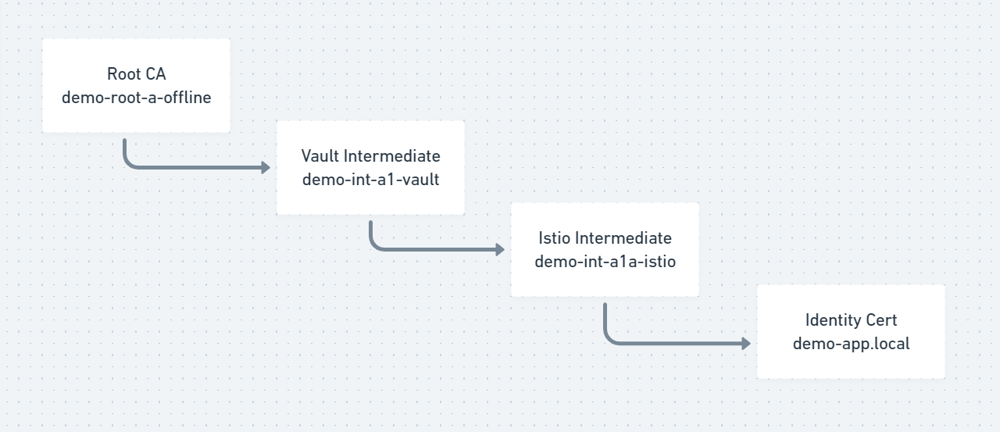

# vault-pki-intermediate-tree
POC 3 tier CA hierarchy with Vault as root, intermediate level 1, and intermediate level 2

## Example without variables (for clarity)

## Example with shell variable templates 

